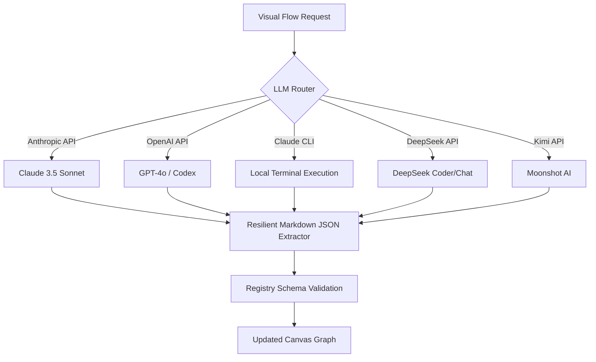

# 🛠️ Rust Code Studio: Visual Flow & Async Compiling Engine

[](https://opensource.org/licenses/Apache-2.0)
[](https://www.rust-lang.org/)
[](https://nodejs.org/)

A premium, state-of-the-art visual programming canvas and compiler engine that empowers developers to architect, orchestrate, test, and debug high-performance, asynchronous Rust services purely visually. 

The canvas compiles graphical flowcharts directly into native, optimized, compile-time type-safe Rust code running on the **Tokio asynchronous runtime**.

---

## 🌟 Architectural Features

### 1. Layered Rank Auto-Layout Engine (Sugiyama BFS)
Say goodbye to messy, manually organized node canvases. The studio features a built-in auto-layout engine based on the **Sugiyama layered rank framework**:
* **Visual Hierarchy:** Performs Breadth-First Search (BFS) to arrange nodes horizontally or vertically based on their dependency ranks.
* **Edge Crossing Minimization:** Automatically aligns connections to reduce visual clutter and keep complex async pipelines highly readable.

### 2. High-Performance Sandboxed WASM Execution Node
Run untrusted plugins safely at native speeds:
* **`wasmi` WASI Integration:** Execute WebAssembly binary nodes in a secure, sandboxed environment.
* **Dynamic I/O Mapping:** Pass data seamlessly from standard Rust flow nodes into WASM execution tasks and fetch outputs safely.

### 3. Portable `.flow` Archive Pipelines
Easily share, package, and import visual codebases:
* **ZIP In-Memory Compression:** Compress the canvas `graph.json`, custom source codes, and static assets into a single portable `.flow` archive.
* **Conflict Resolution Engine:** Handles namespace collisions, file drifts, and schema migrations gracefully upon import.

### 4. Visual SQL Catalog Introspection Builders
Seamless database handshakes without writing repetitive boilerplate:
* **Live Catalog Introspection:** Introspects local or remote SQLite and PostgreSQL schemas.
* **No-Code Query Builder:** Visually map database tables to output ports, auto-generating high-performance `sqlx` query code.

### 5. Zero-Precompile gRPC Tonic Scaffolder
Instantly compile and scaffold high-performance microservices:
* **Dynamic Node Compilation:** Zero pre-compilation steps are required. Write raw `.proto` definitions in the configuration, and the system automatically generates Prost and Tonic structures at build time.
* **Instant Client/Server Scaffolding:** Drag a gRPC server node, map inputs to ports, and serve API calls in under 5 seconds.

### 6. Real-time Co-Authoring & Multiplayer Presence
Co-design pipelines concurrently with your team:
* **WebSocket Replication Broker:** A lightweight, concurrent WS broker backed by a thread-safe `DashMap` room registry.
* **Multiplayer Overlays:** 25 FPS throttled mouse pointer cursors, neomorphic user presence badges, active border warning alerts, and real-time node drag animations.

---

## 🤖 Multi-Provider LLM Flow Designer

The flow designer includes a unified LLM routing engine inside `backend/src/projects/llm.rs` that allows developers to completely generate or refine canvas layouts using the best AI models on the market:



### Supported Providers:
* **Claude API:** Deeply integrated using Anthropic's tool-calling scheme (`update_graph`).
* **OpenAI & Codex:** Standard chat completion using structured JSON output mode (`response_format`). Supports local Codex emulated base URLs via `CODEX_API_BASE`.
* **Claude CLI:** Executes local `claude` CLI commands via a safe subprocess command runner.
* **DeepSeek & Kimi API:** High-speed Chinese/English models supporting JSON completions natively.

---

## 🛠️ System Prerequisites

To build and run the complete studio (including the gRPC Scaffolder and Tonic compiling nodes), your system must meet the following minimum requirements:

1. **Rustup & Cargo:** Rust Stable **1.75+**
2. **NodeJS:** Version **18+** (with NPM)
3. **Protocol Buffers Compiler (`protoc`):** Version **3+** (required for `prost-build` to compile gRPC nodes)
   - *Ubuntu/Debian:* `sudo apt install protobuf-compiler`
   - *MacOS:* `brew install protobuf`
   - *Windows:* `choco install protoc`

---

## 🚀 Quick Start Guide

### 1. Clone & Set Up Backend
Initialize the Rust development workspace and check that the suite compiles:
```bash
# Navigate to the backend directory
cd backend

# Compile the projects, templates, and integration tests
cargo build --all-targets

# Execute the 260+ rigorous E2E integration tests
cargo test
```

### 2. Configure Environment Secrets
Create a `.env` file in the backend directory or export your active LLM API keys:
```bash
export ANTHROPIC_API_KEY="your-anthropic-key"
export OPENAI_API_KEY="your-openai-key"
export DEEPSEEK_API_KEY="your-deepseek-key"
export KIMI_API_KEY="your-kimi-key"
```

### 3. Launch Both Frontend & Backend Concurrently
We provide easy-to-use, multi-platform single-command startup scripts at the project root to start the backend and frontend simultaneously:

* **macOS / Linux**:
  ```bash
  ./start.sh
  ```
* **Windows**:
  ```cmd
  start.bat
  ```

*Or run them individually:*
* **Backend**: `cd backend && cargo run --bin rust_no_code_studio`
* **Frontend**: `cd frontend && npm run dev`

---

## 📄 License

Licensed under the Apache License, Version 2.0 (the "License"); you may not use this file except in compliance with the License. You may obtain a copy of the License at:

[http://www.apache.org/licenses/LICENSE-2.0](http://www.apache.org/licenses/LICENSE-2.0)

Unless required by applicable law or agreed to in writing, software distributed under the License is distributed on an "AS IS" BASIS, WITHOUT WARRANTIES OR CONDITIONS OF ANY KIND, either express or implied. See the License for the specific language governing permissions and limitations under the License.
